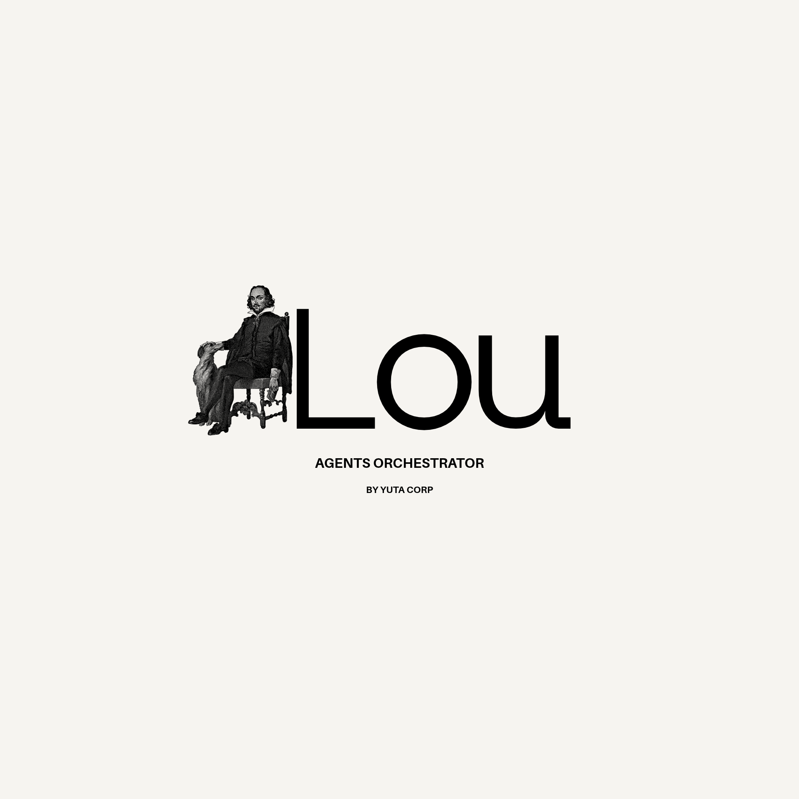

<p align="center">
  
</p>

<h1 align="center">Lou Agents Orchestrator</h1>

<p align="center">
  <strong>The governance layer for AI coding agents.</strong><br />
  Coding agents are fast. Lou makes them accountable — plan, test, verify, review,&nbsp;human&nbsp;approval.<br />
  <em>OpenCode executes. Lou orchestrates.</em>
</p>

<p align="center">
  <a href="https://github.com/Tiavina-Andriamamivony/lou-agents-orchestrator/actions/workflows/ci.yml"></a>
  <a href="LICENSE"></a>
  = 22">
  
  
  
</p>

<p align="center">
  <a href="#the-problem-lou-solves">The problem</a> ·
  <a href="#how-it-works">How it works</a> ·
  <a href="#who-its-for">Who it's for</a> ·
  <a href="#principles">Principles</a> ·
  <a href="#safety-model">Safety</a> ·
  <a href="#roadmap">Roadmap</a> ·
  <a href="#getting-started">Getting started</a>
</p>

---

## The problem Lou solves

AI agents write code faster than ever — and with nobody holding them to an engineering
bar. One agent _says_ the tests pass; nobody checked. Another rewrites half the codebase
because a ticket said "improve performance". A third merges without a review.

The bottleneck of AI development is no longer **writing code**. It is **trust and
control**.

Lou is not an IDE, not a chat wrapper, not a CRUD generator. It is the layer that sits
_above_ an agent runtime and turns autonomous coding into a governed engineering process —
the way git turned collaboration into a governed science. Agents keep their velocity;
humans keep the final word.

## How it works

```text
Ticket
  │
  ▼
Understand
  │
  ▼
Plan
  │
  ▼
Human approval          ← the engineer stays in charge
  │
  ▼
Test design             ← tests before implementation
  │
  ▼
Implementation          ← executed by the agent runtime (OpenCode)
  │
  ▼
Verification            ← Lou runs the checks itself — trust is verified
  │
  ▼
Review
  │
  ▼
Human approval
  │
  ▼
Pull request
```

Bounded and audited end to end: every retry is capped, every escalation reaches a human,
every decision is recorded.

## Who it's for

### Development teams

An agent becomes a disciplined team member, not a cowboy:

- **Test-first by construction** — behaviour is specified as failing tests _before_ any
  business code is written.
- **Verification over trust** — an agent asserting "tests pass" is not proof. Lou runs
  the checks itself and only advances when they are green.
- **Small blast radius** — changes stay small, isolated and reversible.
- **Human gates where they matter** — plan approval, review, merge. You delegate
  execution, never authority.
- **Bounded loops** — a run that exhausts its budget stops and escalates instead of
  improvising.

### Teams building without dedicated coders

For product teams and founders who describe intent instead of writing code:

- Describe the goal in plain language. Lou plans the work, writes the tests, implements,
  verifies and opens a pull request.
- You supervise outcomes instead of writing syntax — plan, result, approve or reject, in
  natural language.
- No codebase hostage: the result is a normal repository your team can read, review and
  take back at any time. **The human is the final authority.**

### Engineering leaders and business

Agent adoption is a governance decision, not a tool choice:

- **Least privilege** — every agent role receives only the permissions its task requires.
  No blanket access to production or secrets.
- **Audit trail** — every call, approval and command recorded and replayable. If it
  shipped, you can show exactly how, when and who approved it.
- **Fail closed** — when a critical operation cannot be assessed, the run stops. It never
  executes by default.
- **Model agnostic** — different models orchestrated for different tasks. No single
  vendor lock-in.
- **Policy at the platform level** — rules live in enforced policy and lint/CI gates, not
  in prompts anyone can forget.
- **Reproducible** — a run is a documented, bounded process, not a black box.

## Principles

| Principle               | Commitment                                                           |
| ----------------------- | -------------------------------------------------------------------- |
| Human-in-the-loop       | A human is the final authority on high-impact decisions.             |
| Least privilege         | Each agent receives only the permissions its task requires.          |
| Test first              | Expected behaviour is specified and testable before business code.   |
| Small blast radius      | Changes stay small, isolated and reversible.                         |
| Verification over trust | An agent asserting "tests pass" is not proof. Lou runs them.         |
| Fail closed             | When a critical operation cannot be assessed, stop — do not execute. |
| Model agnostic          | Different models can be orchestrated for different tasks.            |
| Reproducible            | Every run can be traced and, as far as possible, replayed.           |

## Safety model

- **Bounded workflows** — the state machine caps every retry loop; when a run exceeds its
  iteration budget it stops and asks for a human.
- **Policy engine** — every sensitive action is classified (`ALLOW / DENY / ASK_HUMAN`)
  before execution; destructive commands require approval.
- **Capability-based permissions** — each agent role gets an explicit capability set.
- **Audit trail** — every tool call, approval and command is recorded and replayable.

### NASA Power of Ten as the default engineering policy

Lou ships a configurable baseline policy inspired by the JPL/NASA Power of Ten rules,
tuned for TypeScript/Node: bounded control flow, small functions, minimal scope, explicit
error handling, strict compilation and zero-warning static analysis. The same rules are
enforced — non-negotiably — on Lou's own codebase through the linter and CI, so the
product dogfoods the policy it governs with.

## Current state

**Shipped:**

- `@lou/state-machine` — deterministic, bounded workflow engine (phases, commands,
  transition rules, iteration budgets) with explicit human approval gates for the plan
  and the review.
- `@lou/opencode-runtime` — the `AgentRuntime` port plus an `OpenCodeRuntime` adapter
  driving the `opencode run` CLI (spawn, timeout, abort, status).
- `@lou/command-runner` — shared `CommandRunner` port and Node spawn implementation
  reused by every adapter that shells out.
- `@lou/git` — the git adapter: create branch, commit, push, current branch, clean check.
- `@lou/github` — GitHub adapter on the `gh` CLI: fetch issues, open pull requests.
- `@lou/reviewer` — review agent: structured pre-review (correctness, architecture, tests,
  security, complexity, regressions, policy) returning `APPROVED / CHANGES_REQUESTED /
BLOCKED`, mapped onto the workflow commands.
- `@lou/test-runner` — runs the project test command itself and reports a pass/fail
  verdict (verification over trust, no agent assertion taken at face value).
- `@lou/policy-engine` — `ALLOW / DENY / ASK_HUMAN` policy engine: destructive/risky
  patterns, production/secret/config guards, role capabilities.
- `@lou/constitution` — persistent project rules, default 12-rule template, store at
  `.add/constitution.md`.

**Next (following the spec's priority order):** the test workflow and human approval
gates, the orchestrator loop, the CLI, and GitHub integration.

Everything ships test-first, zero-warning lint, strict typecheck, dead-code analysis, and
a green CI on Node 22 and 24. `main` is protected.

## Roadmap

| Phase | Focus                                                                                    |
| ----- | ---------------------------------------------------------------------------------------- |
| 0     | Proof of concept: CLI + agent runtime + git + manual ticket + plan + tests + review loop |
| 1     | MVP: GitHub issues/PRs, policy engine, project constitution, human gates, audit, sandbox |
| 2     | Agent platform: multiple agents/models, MCP, model routing, cost control                 |
| 3     | Team/enterprise: organizational policies, RBAC, shared projects, compliance              |
| 4     | Ecosystem: Linear, Jira, GitLab, cloud environments, plugin marketplace                  |

MVP scope is fixed in the [product specification](docs/cahier-des-charges.md) (§47, in
French) — the design contract this repository implements.

## Why not just "vibe code"?

|                   | Raw agent CLI                 | IDE chat                  | Lou                                      |
| ----------------- | ----------------------------- | ------------------------- | ---------------------------------------- |
| Process           | Whatever the model improvises | Whatever the chat decides | A fixed, bounded engineering process     |
| Tests             | Claimed, occasionally trusted | Claimed                   | Written first, then run by Lou           |
| Human control     | Interrupt when things break   | Approve inline            | Explicit gates: plan, review, merge      |
| Safety            | Depends on the prompt         | Depends on the prompt     | Enforced policy + capability permissions |
| Auditability      | Barely                        | Barely                    | Every decision recorded                  |
| Model portability | Tied to one provider          | Tied to one provider      | Model-agnostic by design                 |

## Repository layout

```text
lou/
├── apps/
│   └── cli/                      # the `lou` CLI (roadmap)
├── packages/
│   ├── core/
│   │   ├── state-machine/        # workflow engine + human approval gates
│   │   ├── constitution/         # persistent project rules model + store
│   │   ├── command-runner/       # shared CommandRunner port + Node spawn impl
│   │   ├── test-runner/          # runs the project tests, verification over trust
│   │   └── sandbox/              # workspace confinement + policy gate per command
│   ├── git/
│   │   └── src/                  # git adapter: branch, commit, push, clean check
│   ├── agents/
│   │   └── reviewer/             # structured pre-review, verdict → workflow
│   ├── integrations/
│   │   └── github/               # gh CLI adapter: issues, pull requests
│   ├── policy/
│   │   └── engine/               # rules, risk classification, permissions
│   ├── runtimes/
│   │   └── opencode/             # AgentRuntime port + OpenCode adapter
│   └── storage/                  # runs, artefacts, audit trail (roadmap)
├── public/
│   └── logo.png                  # Lou brandmark
├── docs/
│   └── cahier-des-charges.md     # product specification (FR)
└── .github/
```

## Getting started

Requirements: Node.js >= 22, pnpm >= 10.

```bash
pnpm install
pnpm check      # lint → typecheck → knip → tests
pnpm test       # unit tests (Vitest)
```

The `packageManager` field pins pnpm; enable Corepack with `corepack enable` if your
environment requires it. The spec priority order and the contribution workflow live in
[`CONTRIBUTING.md`](CONTRIBUTING.md).

## Development workflow

- Conventional commits (`feat:`, `fix:`, `refactor:`, `test:`, `docs:`, `ci:`, `chore:`).
- TDD: write the failing test, watch it fail, then make it pass.
- One file, one role. One class per file. One responsibility per function.
- TypeScript strict with zero warnings — the CI pipeline is the gate.
- One feature per branch, PR per feature, merge once green.

## Non-goals

- Not an IDE and not a replacement for OpenCode.
- Not an LLM wrapper — no single locked-in model.
- Not a CRUD generator.
- Not a system that deploys to production automatically.

## Security

Report vulnerabilities privately — see [`SECURITY.md`](SECURITY.md).

## License

[MIT](LICENSE) — © 2026 Lou Agents Orchestrator contributors.

---

<p align="center">
  <br />
  <em>OpenCode executes. Lou orchestrates.</em>
</p>
